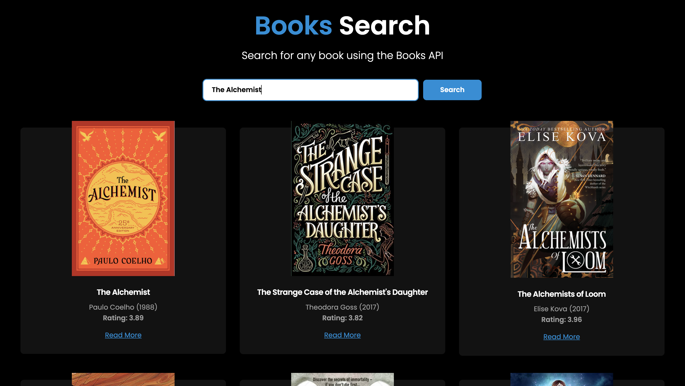

<div align="center">
	<h2>Books App</h2>
</div>

> [Live Preview](https://rapidapi-example-books-app.vercel.app/)

### ⚡️ Features

- Search for Books based on multiple parameters.
- Responsive design.

### 🛠️ Installation Steps

1. Download the `books-app` directory. Click [here](https://github.com/Jed0203/book-search/archive/refs/heads/main.zip) to download it.

2. Unzip the downloaded file and navigate to the working directory.

3. Install dependencies

```bash
npm install
```

4. Run the app

```bash
npm run dev
```

You are all set! Open [localhost:3000](http://localhost:3000/) to see the app.
